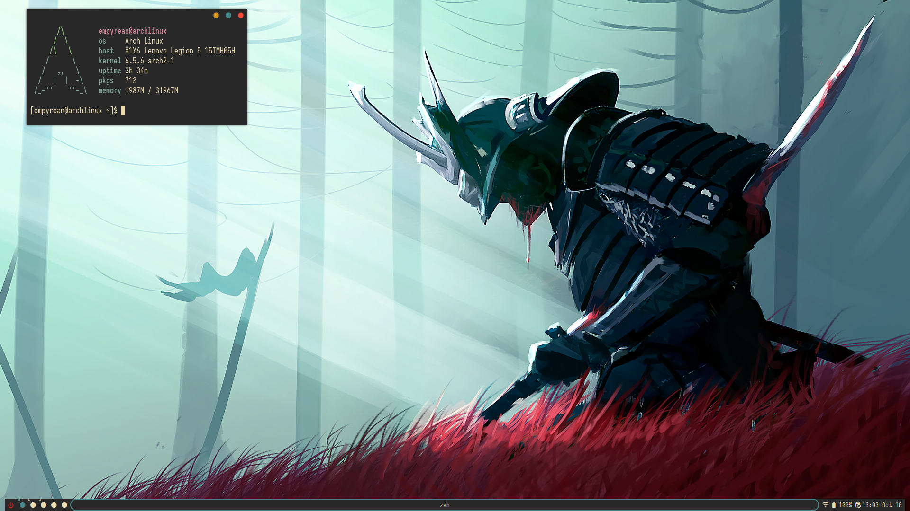

# awesomewm

Dotfiles for the Awesome window manager

## Roadmap

**Version 1.0.0**

- [X] Improve wibar
- [X] Make configuration modular
- [X] Install script

## Installation

Clone this repository:

`git clone https://github.com/Empyrean-Void/awesomewm ~/.config/awesome`

Run the installation script:

`cd ~/.config/awesome && ./install/install.sh`

**It is recommended to look over the `pkglist.txt` file, not all users need Nvidia drivers.**

## Screenshots

